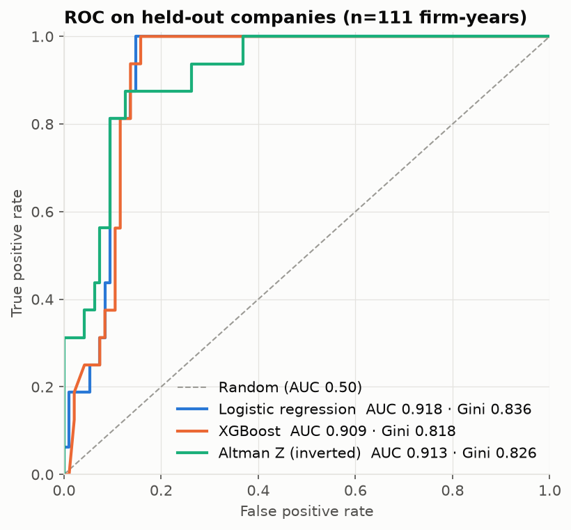
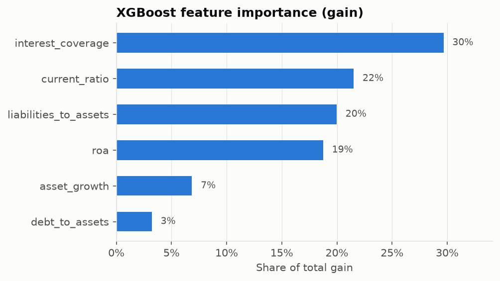
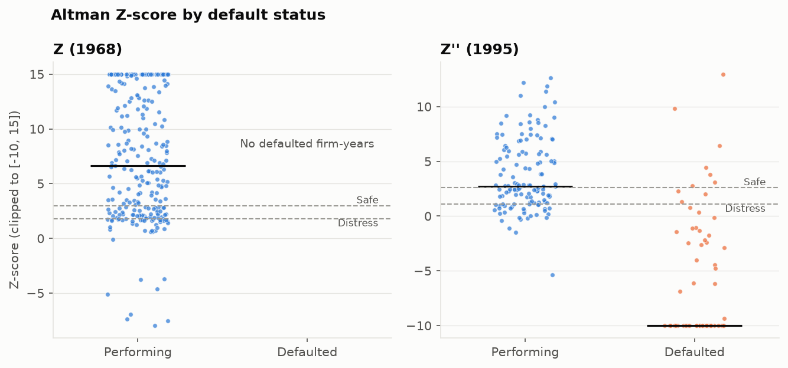
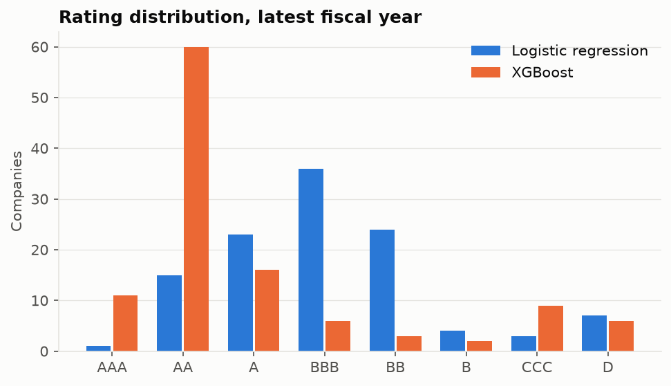

# credit-scorecard

Probability-of-default (PD) models and a rating scorecard for NSE-listed non-financial companies,
built from annual statements published on Yahoo Finance.

## Data

- **Financials** — balance sheet, income statement and cash flow for 121 NSE tickers via `yfinance`
  (`credit_scorecard/data/raw/financials.csv`). Yahoo serves roughly the last four fiscal years (FY2023–FY2026),
  and fiscal-year-end market capitalisation is converted to each company's reporting currency.
- **Labels** — `credit_scorecard/data/raw/default_events.csv` lists curated default and stress events (CIRP
  admissions, disclosed payment defaults, RBI interventions). A firm-year is labelled as a default
  if its fiscal year ends no more than 24 months before the event and no later than the event's
  resolution date.
- **Coverage** — DHFL, Reliance Capital, IL&FS Transportation, IL&FS Engineering, SREI
  Infrastructure, Jaiprakash Associates and Future Retail are delisted or suspended, and Yahoo
  serves no statements for them. Yes Bank's 2020 stress event falls outside the available window.
  Financial-sector firms are excluded because the ratio set and Altman models do not apply to bank
  balance sheets.
- **Final sample** — 447 firm-years, 113 companies, 61 default firm-years from 17 companies.

## Models

| Model | Specification |
|---|---|
| Altman Z (1968) | `1.2·WC/TA + 1.4·RE/TA + 3.3·EBIT/TA + 0.6·MVE/TL + 1.0·Sales/TA`; zones < 1.81 / 1.81–2.99 / > 2.99 |
| Altman Z'' (1995) | `6.56·WC/TA + 3.26·RE/TA + 6.72·EBIT/TA + 1.05·BVE/TL`; zones < 1.10 / 1.10–2.60 / > 2.60. Applied to non-manufacturing sectors and industries (services, utilities, real estate, construction, transport, retail) |
| Logistic regression | Median imputation → 1/99% winsorisation → standardisation → L2 logistic; `C` tuned by grouped CV |
| XGBoost | Depth-limited gradient-boosted trees; 40-draw randomised search over depth, learning rate, rounds, regularisation and subsampling |

Features: debt/assets, liabilities/assets, interest coverage (EBIT/interest, capped at ±50),
ROA (net income / average assets), current ratio and year-on-year asset growth.

All cross-validation uses `StratifiedGroupKFold` on ticker, so firm-years from one company
never appear on both sides of a split. The held-out test set has 28 companies that are not used for tuning.

## Ratings

Model PDs are estimated on a sample with a 13.6% default rate. Before grading, they are rescaled
to a 2% population default rate (`--population-default-rate`) with a prior-correction odds
adjustment. Then they are mapped to grades:

| Grade | AAA | AA | A | BBB | BB | B | CCC | D |
|---|---|---|---|---|---|---|---|---|
| PD upper bound | 0.05% | 0.15% | 0.40% | 1.2% | 4% | 12% | 40% | — |

Per-company PDs in the scorecard are out-of-fold: each company is scored by a model that was
fitted without it. The assigned rating comes from the mean of the LR and XGBoost PDs.

## Results

Held-out companies (111 firm-years, 16 defaults):

| Model | AUC | Gini | KS |
|---|---|---|---|
| Logistic regression | 0.918 | 0.836 | 0.853 |
| XGBoost | 0.909 | 0.818 | 0.842 |
| Altman Z (benchmark) | 0.913 | 0.826 | 0.749 |

Out-of-fold over the full sample: LR AUC 0.903, XGBoost AUC 0.934.

Altman zone default rates: Distress 41.8% (122 firm-years), Grey 3.9% (77), Safe 2.8% (248).

Most labelled defaults are already in insolvency or prolonged default, so their statements are
deeply distressed. Discrimination is therefore much higher than for a forward-looking PD on
performing borrowers, and these figures should not be read as early-warning performance.






## Outputs

| File | Contents |
|---|---|
| `credit_scorecard/results/scorecard.csv` | Latest fiscal year per company: Z-score, zone, LR PD, XGBoost PD, grades, assigned rating |
| `credit_scorecard/results/firm_year_scores.csv` | Features, labels and scores for every firm-year |
| `credit_scorecard/results/metrics.json` | Test, CV and out-of-fold metrics, hyperparameters, default rates by zone and grade |
| `credit_scorecard/results/lr_coefficients.csv` | Standardised coefficients and odds ratios |
| `credit_scorecard/results/xgb_feature_importance.csv` | Gain-based importance |
| `credit_scorecard/data/processed/features.csv` | Modelling table |

## Running

```
pip install -r credit_scorecard/requirements.txt
python -m credit_scorecard.main            # uses cached data in credit_scorecard/data/raw
python -m credit_scorecard.main --refresh  # re-downloads from Yahoo Finance
```

## Structure

```
README.md
credit_scorecard/
  data/          raw + processed CSVs
  models/        altman.py, logistic.py, xgb_model.py
  utils/         data_loader.py, feature_engineering.py, rating_map.py, evaluation.py, plotting.py
  plots/
  results/
  main.py
  requirements.txt
```
